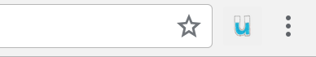
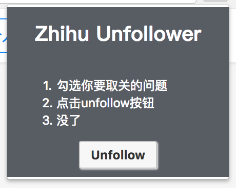

# Zhihu Unfollower

一个简易的chrome扩展程序, 能够批量的取关用户关注的问题~

p.s. 写这个的起因是当时想清洗帐号, 但发现取关问题居然需要点进去取关...醉了...

## Built with

javascript (pure)
html5
css3

## Installing

我看了下chrome app的publish的流程, 感觉好麻烦，要申请账号验证交钱再验证...我这么懒的人肯定就拉倒了.
要是真有童鞋想试用一下，直接打包下载, 进入[chrome://extensions], 打开developer mode, 本地加载就可以了.

## Demo

1. 成功安装的话, chrome右上角会有这个扩展的icon. 平时是灰色的, 也就是未启动. 必须进入页面<u>[https://www[.]zhihu[.]com/people/你的id/following/questions[queryString]]</u>才会启动(变成彩色).

2. 点击那个icon, 你会发现当前页每一个问题后面有一个checkbox.

3. 勾选你想要取关的问题, 按unfollow, 搞定.

## License

欢迎自己使用或者修改, 其他就算了.
